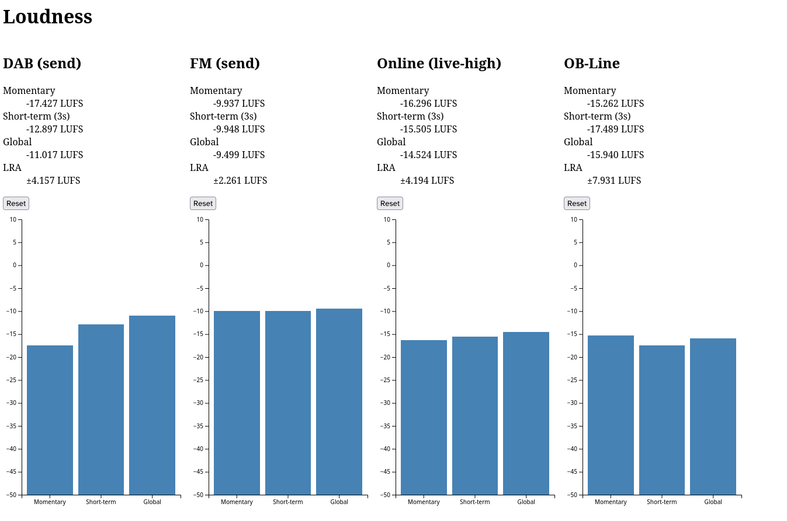

# loudness-server

## What

A loudness-measuring web-app for monitoring multiple streams at once.

## How

It takes audio inputs from JACK, measures their loudness according to EBU R 128, and then streams that data to a simple web UI.

## :eyes:



## Usage

Only tested on linux, but JACK is apparently supported on other platforms.

Compile the binary using `cargo build --release`, and the resulting executable will be in `target/release/loudness-server`. The binary dynamically links against JACK, so pipewire is supported via pipewire-jack.

Create a config file like [the example](example_config.json), and name it `config.json`:

```json5
{
    "web": {
        // host and port for the web server to listen on
        "host": "::1",
        "port": 8080
    },
    "inputs": {
        // Internal ID, used to name JACK input ports
        "live_high": {
            // Display name, used in the web UI
            "name": "Online (live-high)",
            // optional, number of channels this input has
            "channels": 2
        },
        "fm_send": {
            "name": "FM (send)"
        },
        "dab_send": {
            "name": "DAB (send)"
        }
    },
    "jack": {
        // Optional, defaults to "loudness_meter"
        "client_name": "loudness"
    }
}
```

Run the executable, and open the web UI using the port you configured.

You'll need to link things to the input ports in JACK to feed audio into the server. This can be done with `jack_connect`. Input ports are named as `{id}_{i}` where `{i}` is the index of the channel, starting from zero.

For example, with the configuration above, to link a stereo input (say from a liquidsoap script) to the input named `live_high`, you could use the following:
```bash
jack_connect live_high:out_0 loudness:live_high_0
jack_connect live_high:out_1 loudness:live_high_1
```

The path to the config file can be changed with the environment variable `CONFIG_PATH`.

## References

- [EBU R 128](https://en.wikipedia.org/wiki/EBU_R_128)
- [JACK2](https://github.com/jackaudio/jack2)
